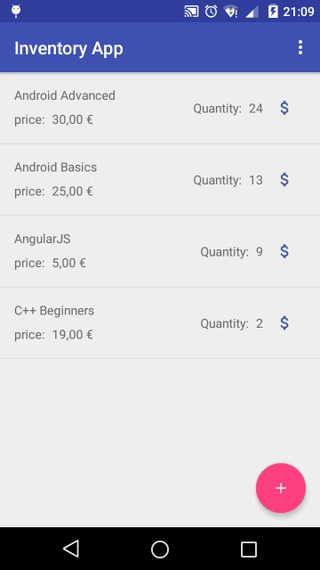

# Inventory App
## Presentation
This is the eighth and nineth project of the Android Basics Nanodegree.
The goal of this project is to design and create the structure of an Book Store App which would allow a store to keep track of its inventory.

## New Technicals Points
* Use of contract to describe the database
* Use of SQLiteOpenHelper
* Use of insert query
* Use of read query
* use of delete query

## Screenshots

